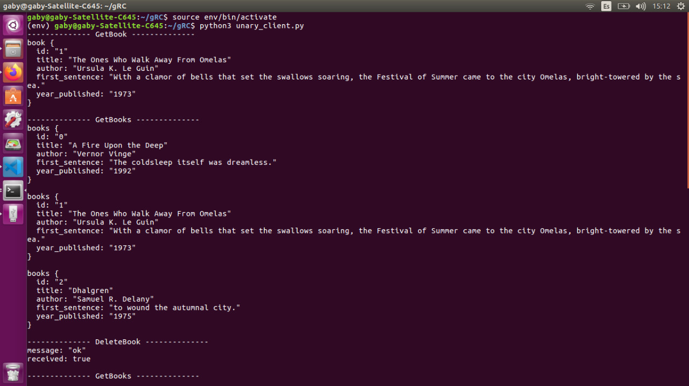
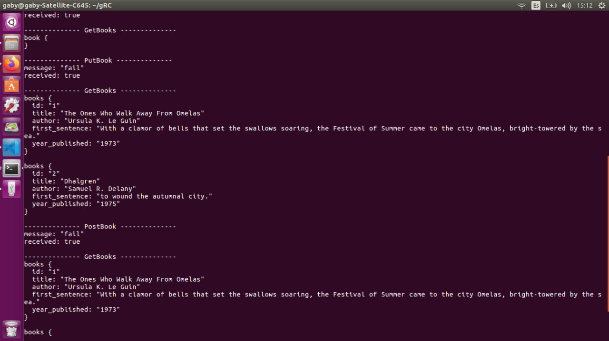
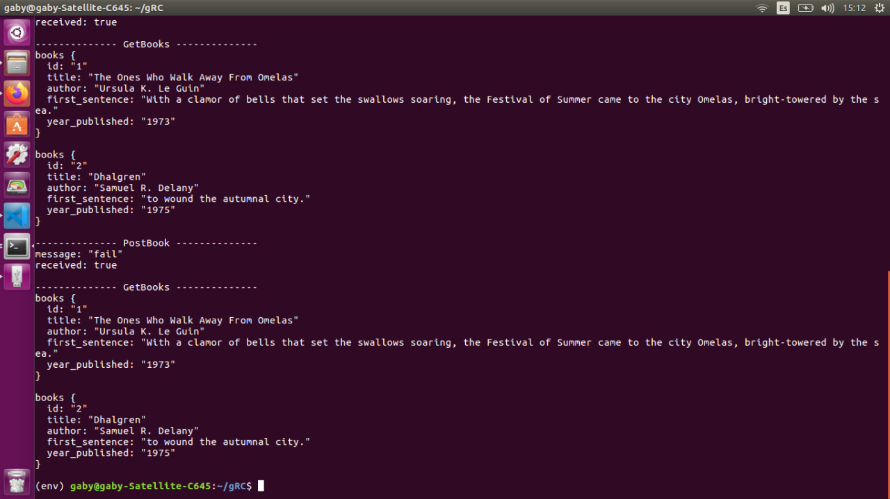

# Python REST API tutorial

### Dependencias necesarias:

- Python 3.5 o superior

## Entendiendo el código

El código implemento un gRPC en Python. 

### Métodos

En un gRPC los métodos se manejas por medio de servicios, estos son declaros en un achivo con extensión .proto (búfer de protocolo).

Cada servicio tiene un nombre un método, un parámetro y un retorno. 

Los búfer de protocolo definen la estructura de los datos que se desea en un archivo proto, estos se organizan por medio de mensajes y cada mensaje es un pequeño registro lógico de la información.

La estructura de estos mensajes por medio de un par de serie valor llamados campos.

Ejemplo mensajes:
```proto
message Book{
    string id = 1;
    string title = 2;
    string author = 3;
}
```

En gRPC se pueden hacer varias tipos de implementaciones:
* **RPC unutarios** funciona como una llamada de función normal, Envia una única solicitud como una llamada de función y obtiene una única respuesta del servidor.

Ejemplo
```proto
rpc getBook(RequestMessage) return (ResponseMessage)
```

* **RCP de transmisión por secuencuencia del servidor** El cliente envia un mensaje declarado en el archivo .proto al servidor y obtiene una secuencia de mensajes para leer.

Ejemplo
```proto
rpc getBook(RequestMessage) return (stream ResponseMessage)
```
* **RCP de transmisión por secuencia del cliente** El cliente escribe una secuencia de mensajes utilizando una secuencia de escritura, el servidor lee todos los mensajes y devuelve una respuesta

Ejemplo
```proto
rpc getBook(stream RequestMessage) return (ResponseMessage)
```

* **RCP de transmisión bidireccional** El servidor puede leer todos los mensajes de respues devolver o puede leer y responder al mismo tiempo. Las lecturas y las escrituras operan de forma independiente.

Ejemplo
```proto
rpc getBook(stream RequestMessage) return (stream ResponseMessage)
```

### Ejecución del ejemplo

Descargar el código desde el repositorio:}

```sh
$ git clone https://github.com/gabytec/Python_gPRC_API_tutorial.git
```
El comando anterior crear un direccotio llamado Python_gRPC_API_tutorial. Entonces accedemos al directorio con el comando:

```sh
$ cd Python_gRPC_API_tutorial
```

Dentro del directorio, instalaremos el ambiente de desarrollo con los comandos:

```sh
$ virtualenv -p python3 env
```
```sh
$ source env/bin/activate
```
```sh
$ pip install grpcio grpcio-tools
```

Ya tenemos configurado el ambiente de desarrollo, ahora vamos a ejecutar el programa.

Primero levantamos el servidor.
```sh
$ python3 unary_server.py
```
Ahora ejecutamos en el cliente

```sh
$ python3 unary_client.py
```

Desde terminal se podrá ver los resultados de los metodos ejecutados por el cliente

||
|:--:|
|**Figure 1**: Resultado de la ejecución del cliente.|

||
|:--:|
|**Figure 2**: Resultado de la ejecución del cliente.|

||
|:--:|
|**Figure 3**: Resultado de la ejecución del cliente.|

Si desea realuzar más pruebas con el cliente, en el código en el método **run()** se ejecuta los métodos  

El puede ejecutar 5 métodos, los cuales son:
* **def get_book(stub, value)** Este método recibe un value, el cual, es el id de un libro y muestra la información almacena del mismo.  

* **def get_books(stub)** Este método obtiene la información de todos lo libros almacenados.

* **def delete_book(stub, value)** Este método recibe como parámetro un valor, el cual, es el id del libro que se desea eliminar y muestra un mensaje de confirmación por parte del server.

* **def put_book(stub, id, key, value)** Este método, recibe el id del libro, el valor que se desea cambiar ("title", "author", "first_sentence",     "year_published") y el valor a cual se desea cambiar y muestra un mensaje de confirmación por parte del server

* **def post_book(stub, idB, title, author, first_sentence, year_published)** Este método agrega un nuevo libro.

**Nota** Si desea cambiar el búfer de protocolo, ejecutar el comando:

```sh
$ python -m grpc_tools.protoc --proto_path=. ./unary.proto --python_out=. --grpc_python_out=.
```


